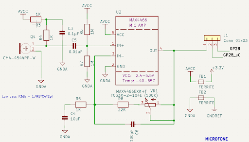
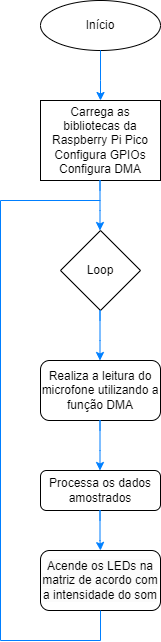

# Microfone, DMA e Matriz de LEDs

A seguir, será desenvolvido passo a passo o código que permite realizar a amostragem com o microfone onboard, utilização do Analog Digital Converter (ADC) juntamente com a função Direct Memory Access (DMA) e então processamento do sinal, para que de acordo com a intensidade do sinal sonoro captado pelo microfone, a matriz de LEDs se acenda.   

## Introdução

Vamos aprender a ler sinais analógicos e processá-los com alta taxa de amostragem usando o recurso do DMA (Direct Memory Access).  

### Características do Sinal de saída do Microfone:
  
O microfone presente na placa, quando não está sujeito a nenhum som, tem um output de tensão igual ao seu offset, que vale 1,65V. Quando o microfone recebe sinais sonoros, a depender da intensidade e frequência do som recebido, sua tensão oscila com frequência equivalente à do sinal recebido, e com maior amplitude a depender da intensidade do som.  
- Offset: 1,65 V (centro da faixa do ADC), podendo ser ajustado com um trimpot.  
- Amplitude máxima: 1,65 V de deslocamento para cima ou para baixo, atingindo 0 V na parte inferior e 3,3 V na parte superior.  
- Range total do sinal: 0 a 3,3 V.  

Como o ADC opera com uma referência de 3,3 V, isso significa que você está usando **toda a faixa dinâmica do ADC**, o que é desejável para maximizar a resolução e a qualidade da leitura.  
  
O Conversor Analógico-Digital (ADC) do RP2040, utilizado no Raspberry Pi Pico, possui as seguintes características:

### 1. Faixa de Medição (Range)  
- **Tensão de Referência (VREF):** A faixa de medição do ADC é de 0V a VREF, sendo que VREF é fixado internamente em 3.3V no RP2040. Isso significa que ele pode medir tensões analógicas entre 0V e 3.3V.  

### 2. Resolução do ADC   
- O ADC do RP2040 tem uma **resolução de 12 bits**, ou seja: ele gera valores inteiros entre **0** (correspondendo a 0V) e (2^12 - 1) = **4095** (correspondendo a 3.3V). A **resolução mínima (step size)** é:  
<p style="text-align: center;"> $$Resol. = V_{ref}/2^{12} = 3.3/4096 \thickapprox 0.00080586 V = 805.86 \mu V$$ </p>
  
### 3. Conversão de Valores para short signed  
ADC do RP2040 fornece valores sem sinal de 12 bits (**0 a 4095**), e o objetivo é convertê-los para um intervalo com sinal (**-2048 a 2047**) para armazenar o valor em um *short signed*.    
A fórmula de conversão é:  
  
Signed value = raw_adc_value − 2048  
  
Isso ajusta o valor bruto lido pelo ADC para variar em torno de 0, com um mínimo de -2048 e máximo de 2047. Isso reflete o comportamento do sinal em torno do ponto de offset de 1,65 V. Sem som, temos então que a saída analógica do microfone é 1,65 V sendo convertido para 0.   
  
É possível fazer esta leitura do sinal digital convertido do microfone e transformar proporcionalmente num valor pwm com 1kHz para acender um led (catodo comum) na cor azul que está ligado no GPIO 12, mas não é o que esse código faz.  
  
### 4. Outras Observações  
- O ADC do RP2040 possui uma entrada de **referência interna**, então o valor de **3.3V** depende da precisão da fonte de alimentação do sistema.

## Desenvolvimento do programa:  

A seguir desenvolvemos, passo-a-passo,  as etapas de síntese de um programa, em linguagem C, para realizar a leitura dos sinais de um microfone presente na BitDogLab.

## Desenvolvimento: 

Como ponto de partida podemos identificar os elementos, ou interfaces, de entrada e saída que serão usados no nosso hardware para implementar este projeto.  
  
A interface de entrada é um componente denominado microfone, que tem uma saída de tensão que varia de acordo com a intensidade e frequência de determinado sinal sonoro ao qual o dispositivo é submetido, e então a leitura é realizada pelo conversor analógico digital e executa uma ação baseada nesse sinal.  
  
Como funciona:  
  
Um microfone é um dispositivo que converte ondas sonoras em sinais elétricos. Ele capta as vibrações do ar causadas por sons e as transforma em um sinal elétrico proporcional à intensidade sonora. Esse processo é essencial para uma ampla gama de aplicações, como gravações de áudio, sistemas de reconhecimento de voz e controle por som em projetos de eletrônica. Na figura abaixo, à esquerda, temos a visão 3D do circuito do microfone na placa BitDog Lab, e à direita, o esquema elétrico desse circuito.   

     
Figura: Visão 3d do circuito do microfone e seu esquema elétrico com os componentes necessários para o circuito funcionar da forma correta realizando a leitura dos sinais sonoros.  
  
O circuito inclui componentes como capacitores, resistores, indutores e um amplificador operacional MAX4466, que realiza o condicionamento do sinal proveniente do microfone. Muitas vezes, esse sinal possui uma amplitude baixa, e para que seja possível sua leitura, é necessário amplificá-lo e filtrá-lo, logo o circuito realiza esse processamento do sinal elétrico, e é esse sinal já tratado adequadamente que é recebido pela GPIO 28 da placa.  
  
É possível selecionar  se desejamos realizar a leitura do microfone da placa colocando o jumper no conector J1 nas posições 1 e 2. Caso queira realizar a leitura de um sensor analógico externo deve-se colocar o jumper em 2 e 3.  

### Fluxograma  
  
Neste fluxograma, vamos destacar e detalhar as seguintes etapas principais em um novo documento chamado de pseudocódigo.  

  
Figura: Fluxograma do código  
  
- **Início:** Representa o ponto de partida do programa.  
   
- **Carrega as bibliotecas da Raspberry Pico e configura as GPIOS:** O programa começa incluindo bibliotecas necessárias para realizar a leitura analógica do GPIO que o microfone está conectado que no caso é a GPIO 28. Neste caso, também configuramos o Direct Memory Access (DMA) e a matriz de LEDs.
  
- **Loop Infinito:** Uma estrutura de repetição (loop) onde o programa realiza a leitura continuamente do sinal de saída proveniente do microfone para identificar as características do sinal sonoro recebido a cada instante.
  
- **Leitura do microfone e processamento dos dados:** O programa lê as informações do microfone utilizando o DMA. Os dados sofrem operações matemáticas para obter uma intensidade média dos dados amostrados na leitura. 
  
- **Controle da matriz de LEDs:** Quanto maior a intensidade média dos dados amostrados, mais LEDs se acenderão na matriz, e com maior intensidade.

Na etapa seguinte podemos transcrever o pseudocódigo em um programa escolhendo alguma linguagem específica, respeitando sua sintaxe e convenções. Esta construção pode ser realizada etapa por etapa respeitando a sequência do pseudocódigo ou então pode ser reaproveitada de um repositório. Normalmente é aqui que o desenvolvedor investe um certo tempo depurando o código e testando até que o resultado atenda as suas expectativas.  
  
Vamos implementar este exemplo em  linguagem C. Apresentamos a seguir o código redigido, mas primeiramente temos de criar alguns arquivos adicionais além do arquivo principal para configurar as funções da matriz de LEDs. 

### Arquivos Adicionais Para Configuração da Matriz de LEDs

Antes de redigir o arquivo de código principal do projeto, importaremos alguns conteúdos do exemplo da [Matriz de LEDs](https://github.com/BitDogLab/BitDogLab-C/blob/Rafael_monitor/neopixel_pio/Readme.md). Primeiro, é necessário criar o arquivo “ws2818b.pio” como indicado [aqui](https://github.com/BitDogLab/BitDogLab-C/blob/Rafael_monitor/neopixel_pio/ws2818b.pio). 
Após a criação deste arquivo, é colocado dentro dele o texto indicado:  
```ruby
.program ws2818b
.side_set 1
.wrap_target
    out x, 1        side 0 [2]
    jmp !x, 3       side 1 [1]
    jmp 0           side 1 [4]
    nop             side 0 [4]
.wrap 


% c-sdk {
#include "hardware/clocks.h"

void ws2818b_program_init(PIO pio, uint sm, uint offset, uint pin, float freq) {

  pio_gpio_init(pio, pin);
  
  pio_sm_set_consecutive_pindirs(pio, sm, pin, 1, true);
  
  // Program configuration.
  pio_sm_config c = ws2818b_program_get_default_config(offset);
  sm_config_set_sideset_pins(&c, pin); // Uses sideset pins.
  sm_config_set_out_shift(&c, true, true, 8); // 8 bit transfers, right-shift.
  sm_config_set_fifo_join(&c, PIO_FIFO_JOIN_TX); // Use only TX FIFO.
  float prescaler = clock_get_hz(clk_sys) / (10.f * freq); // 10 cycles per transmission, freq is frequency of encoded bits.
  sm_config_set_clkdiv(&c, prescaler);
  
  pio_sm_init(pio, sm, offset, &c);
  pio_sm_set_enabled(pio, sm, true);
}
%}
```

Então deve-se criar o arquivo “neopixel.c”, também no diretório do projeto, onde definiremos algumas funções que serão utilizadas para acender os LEDs da matriz de LEDs.  
  
Abaixo segue o código do arquivo “neopixel.c”:  

```c
#ifndef __NEOPIXEL_INC
#define __NEOPIXEL_INC

#include <stdlib.h>
#include "ws2818b.pio.h"

// Definição de pixel GRB
struct pixel_t {
  uint8_t G, R, B; // Três valores de 8-bits compõem um pixel.
};
typedef struct pixel_t pixel_t;
typedef pixel_t npLED_t; // Mudança de nome de "struct pixel_t" para "npLED_t" por clareza.


// Declaração do buffer de pixels que formam a matriz.
static npLED_t *leds;
static uint led_count;

// Variáveis para uso da máquina PIO.
static PIO np_pio;
static uint np_sm;

/**
 * Inicializa a máquina PIO para controle da matriz de LEDs.
 */
void npInit(uint pin, uint amount) {

  led_count = amount;
  leds = (npLED_t *)calloc(led_count, sizeof(npLED_t));

  // Cria programa PIO.
  uint offset = pio_add_program(pio0, &ws2818b_program);
  np_pio = pio0;

  // Toma posse de uma máquina PIO.
  np_sm = pio_claim_unused_sm(np_pio, false);
  if (np_sm < 0) {
    np_pio = pio1;
    np_sm = pio_claim_unused_sm(np_pio, true); // Se nenhuma máquina estiver livre, panic!
  }

  // Inicia programa na máquina PIO obtida.
  ws2818b_program_init(np_pio, np_sm, offset, pin, 800000.f);

  // Limpa buffer de pixels.
  for (uint i = 0; i < led_count; ++i) {
    leds[i].R = 0;
    leds[i].G = 0;
    leds[i].B = 0;
  }
}

/**
 * Atribui uma cor RGB a um LED.
 */
void npSetLED(const uint index, const uint8_t r, const uint8_t g, const uint8_t b) {
  leds[index].R = r;
  leds[index].G = g;
  leds[index].B = b;
}

/**
 * Limpa o buffer de pixels.
 */
void npClear() {
  for (uint i = 0; i < led_count; ++i)
    npSetLED(i, 0, 0, 0);
}

/**
 * Escreve os dados do buffer nos LEDs.
 */
void npWrite() {
  // Escreve cada dado de 8-bits dos pixels em sequência no buffer da máquina PIO.
  for (uint i = 0; i < led_count; ++i) {
    pio_sm_put_blocking(np_pio, np_sm, leds[i].G);
    pio_sm_put_blocking(np_pio, np_sm, leds[i].R);
    pio_sm_put_blocking(np_pio, np_sm, leds[i].B);
  }
  sleep_us(100); // Espera 100us, sinal de RESET do datasheet.
}

#endif
```

Agora, será descrito o código do arquivo principal. Neste exemplo foi utilizado o código principal com nome “microphone_dma.c”.

## Pseudocódigo - Linguagem C

Com estas informações estruturadas, podemos passar para a etapa da escrita do código em C. Para facilitar o entendimento, separamos cada parte do programa em um bloco de código após a explicação do pseudocódigo.

**Início:**  Inclusão das bibliotecas “stdio.h”, “math.h”, “pico_stdlib.h”, “hardware_adc.h”, “hardware_dma.h”, e também as funções definidas previamente no arquivo “neopixel.c”.


```c
#include <stdio.h>
#include <math.h>
#include "pico/stdlib.h"
#include "hardware/adc.h"
#include "hardware/dma.h"
#include "neopixel.c"
```

**Definições:** Definição de valores e algumas funções que serão utilizados no código.

```c
// Pino e canal do microfone no ADC.
#define MIC_CHANNEL 2
#define MIC_PIN (26 + MIC_CHANNEL)

// Parâmetros e macros do ADC.
#define ADC_CLOCK_DIV 96.f
#define SAMPLES 200 // Número de amostras que serão feitas do ADC.
#define ADC_ADJUST(x) (x * 3.3f / (1 << 12u) - 1.65f) // Ajuste do valor do ADC para Volts.
#define ADC_MAX 3.3f
#define ADC_STEP (3.3f/5.f) // Intervalos de volume do microfone.

// Pino e número de LEDs da matriz de LEDs.
#define LED_PIN 7
#define LED_COUNT 25

#define abs(x) ((x < 0) ? (-x) : (x))


// Canal e configurações do DMA
uint dma_channel;
dma_channel_config dma_cfg;

// Buffer de amostras do ADC.
uint16_t adc_buffer[SAMPLES];

void sample_mic();
float mic_power();
uint8_t get_intensity(float v);
```

**Função sample_mic():** Definição da função que realiza as leituras do microfone utilizando a função DMA
```c
/**
 * Realiza as leituras do ADC e armazena os valores no buffer.
 */
void sample_mic() {
  adc_fifo_drain(); // Limpa o FIFO do ADC.
  adc_run(false); // Desliga o ADC (se estiver ligado) para configurar o DMA.

  dma_channel_configure(dma_channel, &dma_cfg,
    adc_buffer, // Escreve no buffer.
    &(adc_hw->fifo), // Lê do ADC.
    SAMPLES, // Faz "SAMPLES" amostras.
    true // Liga o DMA.
  );

  // Liga o ADC e espera acabar a leitura.
  adc_run(true);
  dma_channel_wait_for_finish_blocking(dma_channel);
  
  // Acabou a leitura, desliga o ADC de novo.
  adc_run(false);
}
```
**Funções de tratamento das amostras:** Definição da função mic_power(), que calcula o valor RMS das amostras, e da função get_intensity(v), que calcula o valor normalizado do volume medido, a partir do valor RMS médio (v).  

- **mic_power():**
```c
/**
 * Calcula a potência média das leituras do ADC. (Valor RMS)
 */
float mic_power() {
  float avg = 0.f;

  for (uint i = 0; i < SAMPLES; ++i)
    avg += adc_buffer[i] * adc_buffer[i];
  
  avg /= SAMPLES;
  return sqrt(avg);
}
```

- **get_intensity(v):**
```c
/**
 * Calcula a intensidade do volume registrado no microfone, de 0 a 4, usando a tensão.
 */
uint8_t get_intensity(float v) {
  uint count = 0;

  while ((v -= ADC_STEP/20) > 0.f)
    ++count;
  
  return count;
}

```


### **Função Main()**

Inicializa a matriz de LEDs e o ADC:

```c
int main() {
  stdio_init_all();

  // Delay para o usuário abrir o monitor serial...
  sleep_ms(5000);

  // Preparação da matriz de LEDs.
  printf("Preparando NeoPixel...");
  
  npInit(LED_PIN, LED_COUNT);

  // Preparação do ADC.
  printf("Preparando ADC...\n");

  adc_gpio_init(MIC_PIN);
  adc_init();
  adc_select_input(MIC_CHANNEL);

  adc_fifo_setup(
    true, // Habilitar FIFO
    true, // Habilitar request de dados do DMA
    1, // Threshold para ativar request DMA é 1 leitura do ADC
    false, // Não usar bit de erro
    false // Não fazer downscale das amostras para 8-bits, manter 12-bits.
  );

  adc_set_clkdiv(ADC_CLOCK_DIV);

  printf("ADC Configurado!\n\n");
```

Inicializa o canal DMA:

```c
printf("Preparando DMA...");

  // Tomando posse de canal do DMA.
  dma_channel = dma_claim_unused_channel(true);

  // Configurações do DMA.
  dma_cfg = dma_channel_get_default_config(dma_channel);

  channel_config_set_transfer_data_size(&dma_cfg, DMA_SIZE_16); // Tamanho da transferência é 16-bits (usamos uint16_t para armazenar valores do ADC)

  channel_config_set_read_increment(&dma_cfg, false); // Desabilita incremento do ponteiro de leitura (lemos de um único registrador)

  channel_config_set_write_increment(&dma_cfg, true); // Habilita incremento do ponteiro de escrita (escrevemos em um array/buffer)
  
  channel_config_set_dreq(&dma_cfg, DREQ_ADC); // Usamos a requisição de dados do ADC

  // Amostragem de teste.
  printf("Amostragem de teste...\n");
  sample_mic();


  printf("Configuracoes completas!\n");
```

Com as configurações completas, inicia o loop. O microfone é amostrado, e os dados são tratados.

```c
 printf("\n----\nIniciando loop...\n----\n");
  while (true) {

    // Realiza uma amostragem do microfone.
    sample_mic();

    // Pega a potência média da amostragem do microfone.
    float avg = mic_power();
    avg = 2.f * abs(ADC_ADJUST(avg)); // Ajusta para intervalo de 0 a 3.3V. (apenas magnitude, sem sinal)

    uint intensity = get_intensity(avg); // Calcula intensidade a ser mostrada na matriz de LEDs.
```

Ainda dentro do loop, a matriz de LEDs é resetada, e então diferentes padrões são acesos, a depender da intensidade do som medido. O valor obtido também é enviado via monitor serial.

```c
  // Limpa a matriz de LEDs.
    npClear();

    // A depender da intensidade do som, acende LEDs específicos.
    switch (intensity) {
      case 0: break; // Se o som for muito baixo, não acende nada.
      case 1:
        npSetLED(12, 0, 0, 80); // Acende apenas o centro.
        break;
      case 2:
        npSetLED(12, 0, 0, 120); // Acende o centro.

        // Primeiro anel.
        npSetLED(7, 0, 0, 80);
        npSetLED(11, 0, 0, 80);
        npSetLED(13, 0, 0, 80);
        npSetLED(17, 0, 0, 80);
        break;
      case 3:
        // Centro.
        npSetLED(12, 60, 60, 0);

        // Primeiro anel.
        npSetLED(7, 0, 0, 120);
        npSetLED(11, 0, 0, 120);
        npSetLED(13, 0, 0, 120);
        npSetLED(17, 0, 0, 120);

        // Segundo anel.
        npSetLED(2, 0, 0, 80);
        npSetLED(6, 0, 0, 80);
        npSetLED(8, 0, 0, 80);
        npSetLED(10, 0, 0, 80);
        npSetLED(14, 0, 0, 80);
        npSetLED(16, 0, 0, 80);
        npSetLED(18, 0, 0, 80);
        npSetLED(22, 0, 0, 80);
        break;
      case 4:
        // Centro.
        npSetLED(12, 80, 0, 0);

        // Primeiro anel.
        npSetLED(7, 60, 60, 0);
        npSetLED(11, 60, 60, 0);
        npSetLED(13, 60, 60, 0);
        npSetLED(17, 60, 60, 0);

        // Segundo anel.
        npSetLED(2, 0, 0, 120);
        npSetLED(6, 0, 0, 120);
        npSetLED(8, 0, 0, 120);
        npSetLED(10, 0, 0, 120);
        npSetLED(14, 0, 0, 120);
        npSetLED(16, 0, 0, 120);
        npSetLED(18, 0, 0, 120);
        npSetLED(22, 0, 0, 120);

        // Terceiro anel.
        npSetLED(1, 0, 0, 80);
        npSetLED(3, 0, 0, 80);
        npSetLED(5, 0, 0, 80);
        npSetLED(9, 0, 0, 80);
        npSetLED(15, 0, 0, 80);
        npSetLED(19, 0, 0, 80);
        npSetLED(21, 0, 0, 80);
        npSetLED(23, 0, 0, 80);
        break;
    }
    // Atualiza a matriz.
    npWrite();

    // Envia a intensidade e a média das leituras do ADC por serial.
    printf("%2d %8.4f\r", intensity, avg);
  }
}
```

Então, o código completo em C será:

```c
#include <stdio.h>
#include <math.h>
#include "pico/stdlib.h"
#include "hardware/adc.h"
#include "hardware/dma.h"
#include "neopixel.c"

// Pino e canal do microfone no ADC.
#define MIC_CHANNEL 2
#define MIC_PIN (26 + MIC_CHANNEL)

// Parâmetros e macros do ADC.
#define ADC_CLOCK_DIV 96.f
#define SAMPLES 200 // Número de amostras que serão feitas do ADC.
#define ADC_ADJUST(x) (x * 3.3f / (1 << 12u) - 1.65f) // Ajuste do valor do ADC para Volts.
#define ADC_MAX 3.3f
#define ADC_STEP (3.3f/5.f) // Intervalos de volume do microfone.

// Pino e número de LEDs da matriz de LEDs.
#define LED_PIN 7
#define LED_COUNT 25

#define abs(x) ((x < 0) ? (-x) : (x))


// Canal e configurações do DMA
uint dma_channel;
dma_channel_config dma_cfg;

// Buffer de amostras do ADC.
uint16_t adc_buffer[SAMPLES];

void sample_mic();
float mic_power();
uint8_t get_intensity(float v);

/**
 * Realiza as leituras do ADC e armazena os valores no buffer.
 */
void sample_mic() {
  adc_fifo_drain(); // Limpa o FIFO do ADC.
  adc_run(false); // Desliga o ADC (se estiver ligado) para configurar o DMA.

  dma_channel_configure(dma_channel, &dma_cfg,
    adc_buffer, // Escreve no buffer.
    &(adc_hw->fifo), // Lê do ADC.
    SAMPLES, // Faz "SAMPLES" amostras.
    true // Liga o DMA.
  );

  // Liga o ADC e espera acabar a leitura.
  adc_run(true);
  dma_channel_wait_for_finish_blocking(dma_channel);
  
  // Acabou a leitura, desliga o ADC de novo.
  adc_run(false);
}

/**
 * Calcula a potência média das leituras do ADC. (Valor RMS)
 */
float mic_power() {
  float avg = 0.f;

  for (uint i = 0; i < SAMPLES; ++i)
    avg += adc_buffer[i] * adc_buffer[i];
  
  avg /= SAMPLES;
  return sqrt(avg);
}

/**
 * Calcula a intensidade do volume registrado no microfone, de 0 a 4, usando a tensão.
 */
uint8_t get_intensity(float v) {
  uint count = 0;

  while ((v -= ADC_STEP/20) > 0.f)
    ++count;
  
  return count;
}

int main() {
  stdio_init_all();

  // Delay para o usuário abrir o monitor serial...
  sleep_ms(5000);

  // Preparação da matriz de LEDs.
  printf("Preparando NeoPixel...");
  
  npInit(LED_PIN, LED_COUNT);

  // Preparação do ADC.
  printf("Preparando ADC...\n");

  adc_gpio_init(MIC_PIN);
  adc_init();
  adc_select_input(MIC_CHANNEL);

  adc_fifo_setup(
    true, // Habilitar FIFO
    true, // Habilitar request de dados do DMA
    1, // Threshold para ativar request DMA é 1 leitura do ADC
    false, // Não usar bit de erro
    false // Não fazer downscale das amostras para 8-bits, manter 12-bits.
  );

  adc_set_clkdiv(ADC_CLOCK_DIV);

  printf("ADC Configurado!\n\n");

  printf("Preparando DMA...");

  // Tomando posse de canal do DMA.
  dma_channel = dma_claim_unused_channel(true);

  // Configurações do DMA.
  dma_cfg = dma_channel_get_default_config(dma_channel);

  channel_config_set_transfer_data_size(&dma_cfg, DMA_SIZE_16); // Tamanho da transferência é 16-bits (usamos uint16_t para armazenar valores do ADC)

  channel_config_set_read_increment(&dma_cfg, false); // Desabilita incremento do ponteiro de leitura (lemos de um único registrador)

  channel_config_set_write_increment(&dma_cfg, true); // Habilita incremento do ponteiro de escrita (escrevemos em um array/buffer)
  
  channel_config_set_dreq(&dma_cfg, DREQ_ADC); // Usamos a requisição de dados do ADC

  // Amostragem de teste.
  printf("Amostragem de teste...\n");
  sample_mic();


  printf("Configuracoes completas!\n");

  printf("\n----\nIniciando loop...\n----\n");
  while (true) {

    // Realiza uma amostragem do microfone.
    sample_mic();
    // Pega a potência média da amostragem do microfone.
    float avg = mic_power();
    avg = 2.f * abs(ADC_ADJUST(avg)); // Ajusta para intervalo de 0 a 3.3V. (apenas magnitude, sem sinal)

    uint intensity = get_intensity(avg); // Calcula intensidade a ser mostrada na matriz de LEDs.

    // Limpa a matriz de LEDs.
    npClear();

    // A depender da intensidade do som, acende LEDs específicos.
    switch (intensity) {
      case 0: break; // Se o som for muito baixo, não acende nada.
      case 1:
        npSetLED(12, 0, 0, 80); // Acende apenas o centro.
        break;
      case 2:
        npSetLED(12, 0, 0, 120); // Acende o centro.

        // Primeiro anel.
        npSetLED(7, 0, 0, 80);
        npSetLED(11, 0, 0, 80);
        npSetLED(13, 0, 0, 80);
        npSetLED(17, 0, 0, 80);
        break;
      case 3:
        // Centro.
        npSetLED(12, 60, 60, 0);

        // Primeiro anel.
        npSetLED(7, 0, 0, 120);
        npSetLED(11, 0, 0, 120);
        npSetLED(13, 0, 0, 120);
        npSetLED(17, 0, 0, 120);

        // Segundo anel.
        npSetLED(2, 0, 0, 80);
        npSetLED(6, 0, 0, 80);
        npSetLED(8, 0, 0, 80);
        npSetLED(10, 0, 0, 80);
        npSetLED(14, 0, 0, 80);
        npSetLED(16, 0, 0, 80);
        npSetLED(18, 0, 0, 80);
        npSetLED(22, 0, 0, 80);
        break;
      case 4:
        // Centro.
        npSetLED(12, 80, 0, 0);

        // Primeiro anel.
        npSetLED(7, 60, 60, 0);
        npSetLED(11, 60, 60, 0);
        npSetLED(13, 60, 60, 0);
        npSetLED(17, 60, 60, 0);

        // Segundo anel.
        npSetLED(2, 0, 0, 120);
        npSetLED(6, 0, 0, 120);
        npSetLED(8, 0, 0, 120);
        npSetLED(10, 0, 0, 120);
        npSetLED(14, 0, 0, 120);
        npSetLED(16, 0, 0, 120);
        npSetLED(18, 0, 0, 120);
        npSetLED(22, 0, 0, 120);

        // Terceiro anel.
        npSetLED(1, 0, 0, 80);
        npSetLED(3, 0, 0, 80);
        npSetLED(5, 0, 0, 80);
        npSetLED(9, 0, 0, 80);
        npSetLED(15, 0, 0, 80);
        npSetLED(19, 0, 0, 80);
        npSetLED(21, 0, 0, 80);
        npSetLED(23, 0, 0, 80);
        break;
    }
    // Atualiza a matriz.
    npWrite();

    // Envia a intensidade e a média das leituras do ADC por serial.
    printf("%2d %8.4f\r", intensity, avg);
  }
}
```

## Arquivo CMake

Além do arquivo em C (extensão .c), é necessário configurar um arquivo CMake para compilar e executar o programa na Raspberry Pi Pico. Esse arquivo, geralmente chamado CMakeLists.txt, define as configurações de build do projeto, como as bibliotecas que serão usadas, os arquivos de origem e as especificações do sistema.  
  
Aqui está um exemplo básico do CMakeLists.txt para este projeto:  
```ruby
# Defina a versão mínima do CMake
cmake_minimum_required(VERSION 3.13)

# Nome do projeto
project(microphone_dma)

# Inclui os arquivos do SDK da Raspberry Pi Pico
include(pico_sdk_import.cmake)

# Inicializa o SDK do Raspberry Pi Pico
pico_sdk_init()

# Define o executável do projeto, especificando o arquivo principal (microphone_dma.c)
add_executable(microphone_dma
        microphone_dma.c
        )

# Gerar o arquivo header do PIO
pico_generate_pio_header(microphone_dma ${CMAKE_CURRENT_LIST_DIR}/ws2818b.pio)

# Vincula as bibliotecas necessárias para o funcionamento do programa
# pico_stdlib: Inclui as bibliotecas padrão da Raspberry Pi Pico
# hardware_dma: Para utilizar a função Direct Memory Access (DMA)
# hardware_pio: Para operação da máquina pio para utilização da matriz de LEDs
# hardware_adc: Para leitura de ADC
# hardware_timer e hardware_clocks: Para configuração de frequências, temporização, etc.

target_link_libraries(microphone_adc_example 
    pico_stdlib 
    hardware_dma
    hardware_pio
    hardware_timer
    hardware_adc
    hardware_clocks
)

# Gera arquivos adicionais como .map, .bin, .hex, etc., necessários para a programação do microcontrolador
pico_add_extra_outputs(microphone_dma)

# Define a URL de referência para este exemplo (opcional)
# Isso é útil se você estiver compartilhando o código e quiser apontar para uma fonte online
example_auto_set_url(microphone_dma)
```
Nota: Como estamos utilizando o arquivo **ws2818b.pio** para operar a matriz de LEDs, é importante incluir o comando  “pico_generate_pio_header(microphone_dma ${CMAKE_CURRENT_LIST_DIR}/ws2818b.pio)” no arquivo CMakeLists.txt.  
  
Agora que está tudo pronto e configurado, para executar o código, utilize os botões “compile” e “run” para carregá-lo na placa, ou alternativamente:  
  
Crie um diretório de compilação:  
  
mkdir build && cd build  
- Execute o CMake:  

- cmake ..  

- Compile o código:

- make  

- Carregue o arquivo .uf2 gerado na Pico.

## Exercícios

### Exercício 1: Detectar picos de som
Objetivo: Criar um programa que detecte quando o nível de som lido pelo microfone excede um limite (threshold) e envie uma mensagem no console serial indicando o evento.  
  
Descrição do exercício:  
  
- Configure o ADC para ler os valores do microfone conectado ao GPIO 28.  
- Defina um valor de limite (por exemplo, 2000) para o nível de som.  
- Sempre que o valor do som ultrapassar o limite, imprima "Pico de som detectado!" no console.  
- Implemente um pequeno atraso entre as leituras para evitar excesso de mensagens.  
  
Faça um video de no máximo 15 segundos, mostrando seu funcionamento e carregue no Moodle  

### Exercício 2: Medir volume médio  
Objetivo: Criar um programa que calcula e exibe o valor médio de som capturado pelo microfone em intervalos de 1 segundo.  
  
Descrição do exercício:  
  
- Leia o microfone continuamente por 1 segundo, somando os valores lidos.  
- Após 1 segundo, divida a soma pelo número de amostras para calcular a média.  
- Exiba o valor médio no console.  
- Repita o processo continuamente.  
  
Faça um vídeo, de no máximo 15 segundos, mostrando seu funcionamento e carregue no Moodle. 


